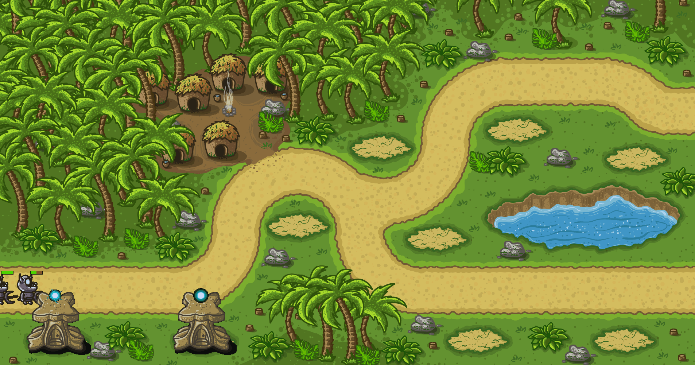
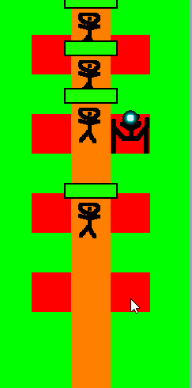

This is a learning project aiming to learn Rust.

The project's scope is not yet decided, it can be anything in this range:
- Simple desktop Tower defense/Anti-tower defense
- Some more advanced TD/AntiTD for android/ios/browser.
- Multiplayer tower war with matchmaking and all the shiny stuff.

**Warning: Custom assets are used which i doesn't have permission to upload, thus the project can't be tested without creating dummy assets which match the ron files in the resources/private_sprites folder.**

Current state (2020.06.30):

User interaction (2020.06.27):

